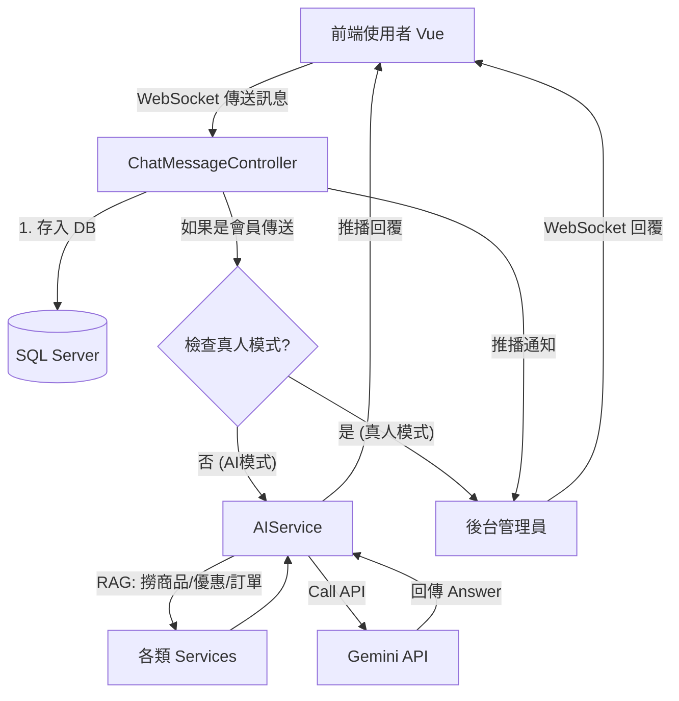

# AI 智能客服實作指南 (Implementation Guide)

這份文件詳細說明了如何從零開始建置這套整合了 **WebSocket 即時通訊**、**Spring AI (Gemini)** 與 **真人客服切換** 的客服系統。

---

## 步驟一：資料庫模型設計 (Database Model)

首先，我們需要一個地方來儲存聊天紀錄。為了支援「軟刪除」與「已讀狀態」，我們在 `ChatMessage` 實體中加入了關鍵欄位。

### 核心實體 (`ChatMessage.java`)

1.  **`memberId`**: 關聯到會員，讓我們知道是誰傳的。
2.  **`sender`**: 用字串區分發送者 (`MEMBER`, `AI`, `ADMIN`)。
3.  **`isRead`**: 用於計算後台未讀數量。
4.  **`isVisibleToUser` (關鍵)**: 實作「結束對話」功能的基礎。當使用者結束對話時，我們將此設為 `false`，但後台管理員仍可看見完整紀錄 (軟刪除)。

```java
@Entity
@Table(name = "chat_message")
public class ChatMessage {
    @Id @GeneratedValue(strategy = GenerationType.IDENTITY)
    private Integer id;

    private Integer memberId; // 誰的對話
    private String sender;    // MEMBER, AI, ADMIN
    
    @Column(columnDefinition = "NVARCHAR(MAX)")
    private String content;   // 內容
    
    // ... 其他欄位 ...
    
    @Builder.Default
    @Column(name = "is_visible_to_user")
    private Boolean isVisibleToUser = true; // 預設可見
}
```

---

## 步驟二：商業邏輯層 (Service Layer)

Service 層負責處理核心業務，包括訊息的儲存、狀態管理與定期清理。

### 1. 聊天訊息服務 (`ChatMessageService.java`)

我們在這裡實作了幾個重要機制：

*   **真人模式狀態管理 (`humanModeMap`)**:
    *   使用 `ConcurrentHashMap<Integer, Boolean>` 在記憶體中紀錄哪些會員正在與真人對話。
    *   若為 `true`，AI 將暫停介入，直到對話結束。
*   **軟刪除實作 (`endSession`)**:
    *   當呼叫 `endSession` 時，除了清除真人模式標記，還會呼叫 Repository 將該會員的歷史訊息 `isVisibleToUser` 設為 `false`。
*   **權限分離的歷史紀錄**:
    *   `getChatHistory`: 給後台看 (包含已隱藏的)。
    *   `getVisibleChatHistory`: 給前台看 (只看得到未隱藏的)。
*   **定期清理 (`cleanupOldMessages`)**:
    *   使用 `@Scheduled` 每天凌晨清理一年前的舊資料，保持資料庫健康。

### 2. AI 腦袋 (`AIService.java`)

這是系統最核心的「大腦」，負責將使用者的問題轉換為有意義的回答。

*   **RAG (檢索增強生成)**:
    *   在呼叫 Gemini 之前，我們先去資料庫撈取「價目表」、「商品庫存」、「優惠券」和「訂單紀錄」。
    *   將這些動態資料組合成 `System Prompt` (系統提示詞)。
*   **Prompt Engineering (提示工程)**:
    *   我們教 AI 如何扮演「親切的客服」。
    *   規定回答格式 (例如卡片式排版、禁止 Markdown 表格)。
    *   設定回答策略 (優先根據提供的資料回答，沒有就誠實說)。
*   **防呆與容錯**:
    *   處理 API 429 (Too Many Requests) 錯誤，回傳友善的忙線訊息。

```java
// AIService 核心邏輯簡化
public String callGemini(Integer memberId, String userMessage) {
    // 1. 準備資料 (RAG)
    String services = serviceItemService.getAll();
    String products = productService.search(userMessage);
    
    // 2. 組合 Prompt
    String systemPrompt = "你是 MaoMaoLand 客服... 參考資料如下: " + services + products;
    
    // 3. 呼叫 Google API
    return restTemplate.postForObject(apiUrl, systemPrompt);
}
```

---

## 步驟三：控制器與即時通訊 (Controller & WebSocket)

這一層負責將前述邏輯串接起來，並處理 HTTP 請求與 WebSocket 訊息。

### 1. REST API (給前端按鈕用)

*   `GET /shop/chat/history`: 前端載入時抓取歷史紀錄。
*   `POST /shop/chat/end`: 前端按下「結束對話」時呼叫，觸發 Service 的軟刪除邏輯。
*   `POST /shop/chat/switchMode`: 強制切換 AI/真人模式 (除錯或測試用)。

### 2. WebSocket 路由 (`@MessageMapping`)

這是即時對話的靈魂所在，流程如下：

1.  **接收訊息**: 使用者發送訊息至 `/app/sendMessage`。
2.  **路由判斷**:
    *   **如果是會員傳的 (`sender="MEMBER"`)**:
        1.  先推播給 **管理員頻道 (`/topic/admin`)**，讓後台即時跳出通知。
        2.  檢查內容是否包含「轉真人」關鍵字 -> 若有，切換模式。
        3.  檢查 `isHumanMode` -> 若為 `false`，呼叫 `AIService` 取得 AI 回覆。
        4.  將 AI 回覆推播回 **會員頻道 (`/topic/member/{id}`)**。
    *   **如果是管理員傳的 (`sender="ADMIN"`)**:
        1.  直接推播給 **該位會員**。
        2.  自動將該會員鎖定為「真人模式」，防止 AI 插嘴。

```java
@MessageMapping("/sendMessage")
public void sendMessage(@Payload Map<String, Object> payload) {
    // 1. 存檔
    ChatMessage msg = chatService.saveMessage(...);
    
    // 2. 判斷發送者
    if ("MEMBER".equals(sender)) {
        // 推給管理員
        messagingTemplate.convertAndSend("/topic/admin", msg);
        
        // AI 判斷
        if (!chatService.isHumanMode(memberId)) {
            String reply = aiService.callGemini(...);
            messagingTemplate.convertAndSend("/topic/member/" + memberId, reply);
        }
    }
}
```

---

## 系統架構圖 (Architecture Summary)



## 總結

這套系統的精髓在於：
1.  **無縫切換**: 使用者無須重新整理，系統自動根據狀態決定是 AI 回還是真人回。
2.  **有記憶的 AI**: 透過後端 RAG 檢索，讓 AI 能夠回答「即時」的庫存與價格，而非瞎掰。
3.  **體驗優化**: 軟刪除機制讓使用者能隨時「重新開始」，但企業端仍保有完整稽核紀錄。
